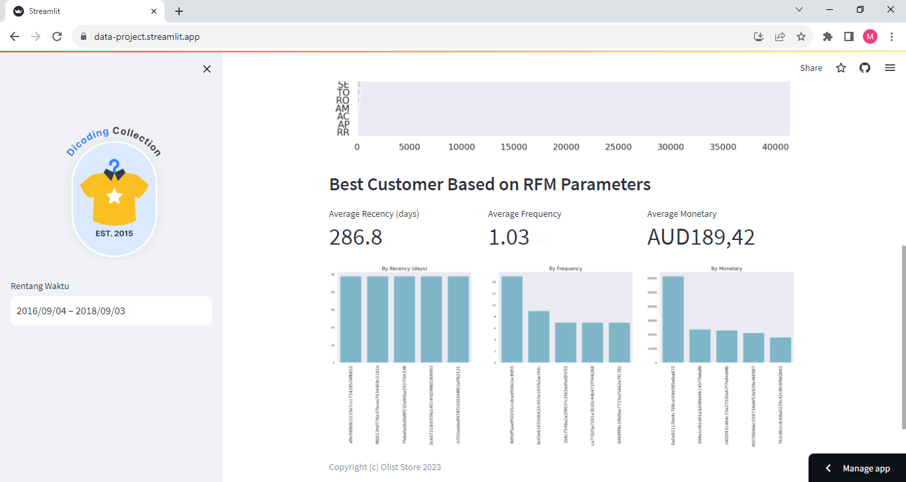

# Olist Store Dashboard ✨

## Setup environment
```
conda create --name main-ds python=3.11.3
conda activate main-ds
pip install numpy pandas matplotlib seaborn streamlit babel
```

## Run streamlit app
```
streamlit run dashboard.py
```

https://data-project.streamlit.app/


